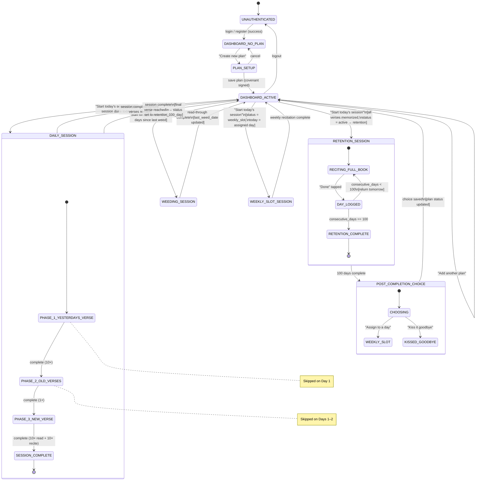
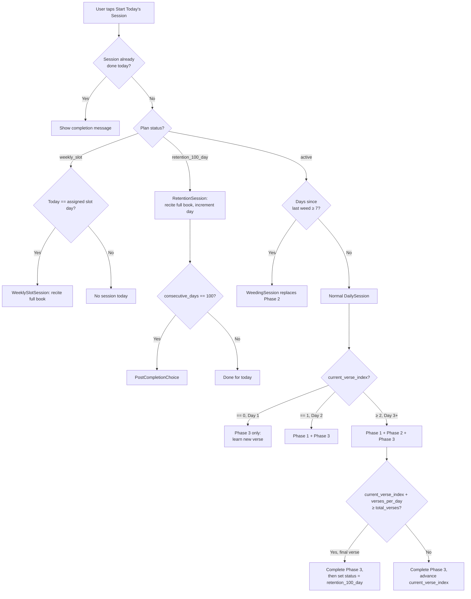

# Scripture Memorization Webapp — Architecture Diagram

Based on *An Approach to Extended Memorization of Scripture* by Dr. Andrew Davis.

---

## Overview

A web application that guides users through Dr. Davis's structured memorization system: daily three-phase practice sessions, weekly "weeding" reviews, a 100-day retention cycle after book completion, and optional weekly maintenance slots. Users authenticate, create a memorization plan for a Bible book, and the app drives them through the correct procedure each day.

---

## Components

### 1. AuthService

**What it does:** Handles user registration, login, and session management. Issues and validates session tokens for all protected routes.

| Direction | Field | Type | Description |
|-----------|-------|------|-------------|
| **Input (register)** | `email` | `string` | User's email address |
| | `password` | `string` | Plain-text password (hashed before storage) |
| **Input (login)** | `email` | `string` | |
| | `password` | `string` | |
| **Output (success)** | `user_id` | `uuid` | Persistent user identifier |
| | `session_token` | `string` | Opaque bearer token for subsequent requests |
| | `expires_at` | `ISO8601 timestamp` | Token expiry |
| **Output (error)** | `error` | `string` | `"invalid_credentials"` \| `"email_taken"` \| `"validation_error"` |

---

### 2. BibleDataProvider

**What it does:** Serves verse text for any reference. Acts as a read-only data layer backed by an embedded Bible data file (JSON or SQLite). No external API calls.

| Direction | Field | Type | Description |
|-----------|-------|------|-------------|
| **Input (single)** | `book` | `string` | Book name, e.g. `"Ephesians"` |
| | `chapter` | `integer` | 1-based chapter number |
| | `verse` | `integer` | 1-based verse number |
| **Input (range)** | `book` | `string` | |
| | `chapter_start` | `integer` | |
| | `verse_start` | `integer` | |
| | `chapter_end` | `integer` | |
| | `verse_end` | `integer` | |
| | `translation` | `string` | e.g. `"ESV"`, `"NIV"`, `"KJV"` |
| **Output** | `verses` | `VerseRecord[]` | Array of verse objects |

**`VerseRecord` format:**
```json
{
  "reference": "Ephesians 1:1",
  "spoken_reference": "One-one",
  "text": "Paul, an apostle of Christ Jesus by the will of God...",
  "book": "Ephesians",
  "chapter": 1,
  "verse": 1,
  "global_index": 0
}
```

> `spoken_reference` is the chapter-verse spoken aloud per Davis's convention (e.g. `"Six-eleven"` for 6:11, `"Twenty-seven twenty-five"` for 27:25).

---

### 3. PlanManager

**What it does:** Creates, edits, and archives memorization plans. Computes the target completion date with a 10% buffer as described by Davis.

| Direction | Field | Type | Description |
|-----------|-------|------|-------------|
| **Input (create)** | `user_id` | `uuid` | |
| | `book` | `string` | Bible book name |
| | `translation` | `string` | Translation identifier |
| | `verses_per_day` | `integer` | e.g. `1`, `6` |
| | `days_per_week` | `integer` | 1–7; Davis recommends `6` |
| | `start_date` | `ISO8601 date` | |
| **Output** | `plan` | `Plan` | Full plan object (see Data Models) |
| | `target_date` | `ISO8601 date` | Computed: `(total_verses / verses_per_week) × 7 × 1.1` |
| | `weekly_schedule` | `WeekEntry[]` | Preview of verse assignments per week |

**`WeekEntry` format:**
```json
{
  "week": 1,
  "new_verses": { "start": "Ephesians 1:1", "end": "Ephesians 1:6" },
  "old_verses": null
}
```

---

### 4. SessionScheduler

**What it does:** The core scheduling engine. Given a plan and its progress record, determines exactly what the user must do in today's session. Checks whether a weeding session is due (≥7 days since last weed). Handles the three daily phases and their verse assignments.

| Direction | Field | Type | Description |
|-----------|-------|------|-------------|
| **Input** | `plan` | `Plan` | Active plan object |
| | `progress` | `Progress` | Current progress record |
| | `date` | `ISO8601 date` | Today's date |
| **Output** | `session_type` | `"daily"` \| `"weeding"` \| `"retention"` \| `"weekly_slot"` | |
| | `yesterdays_verses` | `VerseRef[]` | Verses learned previous session (recite 10×); empty on day 1 |
| | `old_verses_range` | `VerseRef[]` | All verses from start through yesterday (recite 1×); empty on day 1–2 |
| | `new_verses` | `VerseRef[]` | Verses to learn today (read 10×, recite 10×) |
| | `is_weeding_due` | `boolean` | If true, Phase 2 is a weeding session instead of cumulative recitation |

**`VerseRef` format:**
```json
{ "book": "Ephesians", "chapter": 1, "verse": 3, "global_index": 2 }
```

**Scheduling rules:**
- Day 1: only `new_verses` (no Phase 1 or Phase 2)
- Day 2: `yesterdays_verses` + `new_verses` (no Phase 2)
- Day 3+: all three phases
- If `date - last_weed_date >= 7 days`: mark `is_weeding_due = true`, Phase 2 becomes WeedingSession
- If `current_verse_index >= total_verses`: emit `session_type = "retention"`

---

### 5. PracticeSession

**What it does:** The main interactive UI flow that runs a daily session. Orchestrates Phase 1 → Phase 2 → Phase 3 in sequence. On completion, writes a `SessionLog` and updates `Progress`.

**Sub-phases:**

#### Phase 1 — YesterdaysVerse
| Direction | Field | Type | Description |
|-----------|-------|------|-------------|
| **Input** | `verses` | `VerseRef[]` | Yesterday's verse(s) |
| | `repetitions_required` | `integer` | Always `10` |
| **Output** | `phase_complete` | `boolean` | User tapped "Done" after 10 recitations |

*UI: Shows the verse reference only (not text). User recites aloud, taps a counter. At 10, advances to Phase 2.*

#### Phase 2 — OldVersesTogether
| Direction | Field | Type | Description |
|-----------|-------|------|-------------|
| **Input** | `verse_range` | `VerseRef[]` | Full cumulative range from start |
| | `repetitions_required` | `integer` | Always `1` |
| **Output** | `phase_complete` | `boolean` | User tapped "Done" after 1 full recitation |

*UI: Shows the range label (e.g. "Ephesians 1:1 – 3:6"). Bible available on tap for reference. User recites entire section once, then taps "Done".*

#### Phase 3 — NewVerse
| Direction | Field | Type | Description |
|-----------|-------|------|-------------|
| **Input** | `verses` | `VerseRef[]` | New verses to memorize |
| | `read_repetitions` | `integer` | Always `10` |
| | `recite_repetitions` | `integer` | Always `10` |
| **Output** | `phase_complete` | `boolean` | |

*UI: Sub-phase A — shows verse text, user reads aloud 10×. Sub-phase B — hides text, user recites 10×.*

**PracticeSession output (on full completion):**
```json
{
  "session_log_id": "uuid",
  "plan_id": "uuid",
  "date": "2026-02-28",
  "session_type": "daily",
  "phases_completed": ["yesterdays_verse", "old_verses", "new_verse"],
  "new_verse_index_after": 14,
  "completed_at": "2026-02-28T07:42:00Z"
}
```

---

### 6. WeedingSession

**What it does:** Replaces Phase 2 once per week. User reads through the entire currently-memorized section of the book with eyes (not from memory), correcting any errors or omissions ("weeding the garden").

| Direction | Field | Type | Description |
|-----------|-------|------|-------------|
| **Input** | `plan` | `Plan` | Active plan |
| | `verse_range` | `VerseRef[]` | All verses memorized so far |
| **Output** | `session_log` | `SessionLog` | `session_type: "weeding"`, updates `progress.last_weed_date` |

*UI: Displays each verse with text visible in sequence. User scrolls through and reads carefully. "Done" button at end.*

---

### 7. RetentionSession

**What it does:** After the user memorizes the final verse, they enter the 100-day consecutive recitation cycle — reciting the entire book once per day for 100 straight days.

| Direction | Field | Type | Description |
|-----------|-------|------|-------------|
| **Input** | `plan` | `Plan` | Completed plan |
| | `progress` | `Progress` | `consecutive_retention_days` field |
| | `date` | `ISO8601 date` | Today's date |
| **Output** | `updated_consecutive_days` | `integer` | Incremented by 1 if no gap, reset to 0 if a day was missed |
| | `retention_complete` | `boolean` | True when `consecutive_retention_days == 100` |
| | `session_log` | `SessionLog` | `session_type: "retention"` |

*UI: Shows "Day N of 100." User recites entire book. Can optionally show verse list for reference. "Done" button advances counter.*

---

### 8. PostCompletionChoice

**What it does:** After the 100-day cycle, presents the user with Davis's two options for long-term retention and updates the plan status accordingly.

| Direction | Field | Type | Description |
|-----------|-------|------|-------------|
| **Input** | `plan_id` | `uuid` | |
| | `choice` | `"weekly_slot"` \| `"kissed_goodbye"` | User's selection |
| | `weekly_slot_day` | `"Mon"` \| `"Tue"` \| `"Wed"` \| `"Thu"` \| `"Fri"` \| `"Sat"` \| `"Sun"` \| `null` | Required if `choice == "weekly_slot"` |
| **Output** | `updated_plan` | `Plan` | `status` updated to `"weekly_slot"` or `"kissed_goodbye"` |

---

### 9. HighSchoolScheduler *(for books > ~300 verses)*

**What it does:** Manages the rotating four-class review system for long books (e.g. Matthew, Romans). Divides the book into ~10-minute sections (~125 verses each) and rotates them through a 25-day cycle with four "class years." Optional component — activated when the user opts in for a long book.

| Direction | Field | Type | Description |
|-----------|-------|------|-------------|
| **Input** | `plan` | `Plan` | Long-book plan |
| | `sections` | `Section[]` | User-defined chapter groupings (stop at chapter boundaries) |
| | `day_number` | `integer` | Elapsed days since entering retention phase |
| **Output** | `todays_classes` | `ClassAssignment[]` | Which sections to recite today |
| | `graduating_section` | `Section` \| `null` | Section completing its 100th day today |

**`Section` format:**
```json
{ "label": "Matthew 1–5", "start_index": 0, "end_index": 110, "class_year": "senior" }
```

**`ClassAssignment` format:**
```json
{ "section": "Matthew 1–5", "class_year": "senior", "days_completed": 76 }
```

---

### 10. ProgressStore

**What it does:** The persistence layer. All other components read and write through this. Wraps the database. Exposes typed read/write operations; no business logic.

| Operation | Input | Output |
|-----------|-------|--------|
| `getProgress(plan_id)` | `uuid` | `Progress` |
| `updateProgress(plan_id, patch)` | `uuid`, `Partial<Progress>` | `Progress` |
| `logSession(session_log)` | `SessionLog` | `SessionLog` with `id` |
| `getSessionHistory(plan_id, limit)` | `uuid`, `integer` | `SessionLog[]` |
| `getPlans(user_id)` | `uuid` | `Plan[]` |
| `updatePlan(plan_id, patch)` | `uuid`, `Partial<Plan>` | `Plan` |

---

### 11. Dashboard

**What it does:** The authenticated home screen. Displays all active plans, today's task for each, and streak information. Entry point to start any session.

| Direction | Field | Type | Description |
|-----------|-------|------|-------------|
| **Input** | `user_id` | `uuid` | From session token |
| **Output (per plan)** | `plan_summary` | `PlanSummary` | Rendered card for each plan |

**`PlanSummary` format:**
```json
{
  "plan_id": "uuid",
  "book": "Ephesians",
  "status": "active",
  "current_verse": "Ephesians 3:7",
  "percent_complete": 33.5,
  "session_done_today": false,
  "is_weeding_due": true,
  "retention_day": null,
  "streak_days": 12
}
```

---

## Data Models

### `User`
```
id              uuid         PRIMARY KEY
email           string       UNIQUE, NOT NULL
password_hash   string       NOT NULL
created_at      timestamp    NOT NULL
```

### `Plan`
```
id              uuid         PRIMARY KEY
user_id         uuid         FOREIGN KEY → users.id
book            string       e.g. "Ephesians"
translation     string       e.g. "ESV"
total_verses    integer      total verse count for the book
verses_per_day  integer      e.g. 1 or 6
days_per_week   integer      1–7
start_date      date
target_date     date         computed with 10% buffer
status          enum         active | retention_100_day | weekly_slot | kissed_goodbye | paused
weekly_slot_day enum|null    Mon | Tue | Wed | Thu | Fri | Sat | Sun | null
created_at      timestamp
```

### `Progress`
```
id                           uuid      PRIMARY KEY
plan_id                      uuid      FOREIGN KEY → plans.id, UNIQUE
current_verse_index          integer   0-based index into the book's verse list
last_session_date            date|null
consecutive_retention_days   integer   default 0
last_weed_date               date|null
```

### `SessionLog`
```
id               uuid      PRIMARY KEY
plan_id          uuid      FOREIGN KEY → plans.id
date             date
session_type     enum      daily | weeding | retention | weekly_slot
phases_completed string[]  e.g. ["yesterdays_verse", "old_verses", "new_verse"]
completed_at     timestamp
```

---

## Component Interaction Diagram

```mermaid
graph TD
    User["👤 User (Browser)"]

    subgraph Frontend
        Auth["AuthService"]
        Dash["Dashboard"]
        PM["PlanManager"]
        PS["PracticeSession\n(3 phases)"]
        WS["WeedingSession"]
        RS["RetentionSession"]
        PCC["PostCompletionChoice"]
        HS["HighSchoolScheduler\n(optional)"]
    end

    subgraph Backend
        SS["SessionScheduler"]
        BDP["BibleDataProvider"]
        Store["ProgressStore\n(Database)"]
    end

    User -->|credentials| Auth
    Auth -->|session_token| User

    User -->|authenticated requests| Dash
    Dash -->|user_id| Store
    Store -->|Plan[], Progress[]| Dash

    Dash -->|book + settings| PM
    PM -->|Plan| Store

    Dash -->|start session| SS
    SS -->|plan + progress + date| Store
    Store -->|Plan, Progress| SS
    SS -->|session definition| PS
    SS -->|weeding_due| WS
    SS -->|retention| RS

    PS -->|VerseRef[]| BDP
    WS -->|VerseRef[]| BDP
    RS -->|VerseRef[]| BDP
    BDP -->|VerseRecord[]| PS
    BDP -->|VerseRecord[]| WS
    BDP -->|VerseRecord[]| RS

    PS -->|SessionLog + Progress patch| Store
    WS -->|SessionLog + last_weed_date| Store
    RS -->|SessionLog + retention_day++| Store

    RS -->|retention_complete=true| PCC
    PCC -->|Plan patch| Store

    RS -->|long book| HS
    HS -->|ClassAssignment[]| RS
```

---

## State Diagram



---

## Session Decision Flow (SessionScheduler Logic)


